# AWS Certified Developer Associate

## AWS Fundamentals: IAM + EC2

### AWS Regions and AZs

Lets state the fundamental truth first - AWS provides cloud hosting services. The cloud hosting services are available in several regions around the world. The regions, such as North America, have what is called availability zones (AZs). An availability zone refers to a physical data centre within a region. Each availability zone is a physically separate data centre - data centres are isolated to mitigate the impact from disasters. An availability zone takes the region identifier and adds a letter at the end, e.g. ap-southeast-2a. ap-southeast would be the region which is the Asia Pacific region in Sydney Australia. AWS cloud hosted services are tied to a region. An example would EC2 - its availability zone could be af-south-1. EC2 instances launched within the af-south-1 availability zone will physically run in a datacentre in South Africa. 

The AWS cloud hosted services are hosted in a region, except S3 and IAM. The best approach is to work in the region closest to you. [The Global Infrastructure](https://aws.amazon.com/about-aws/global-infrastructure/) page has detailed information about the AWS regions. Click on the `Regions and AZs` tab to get to the regions and availability zones map.

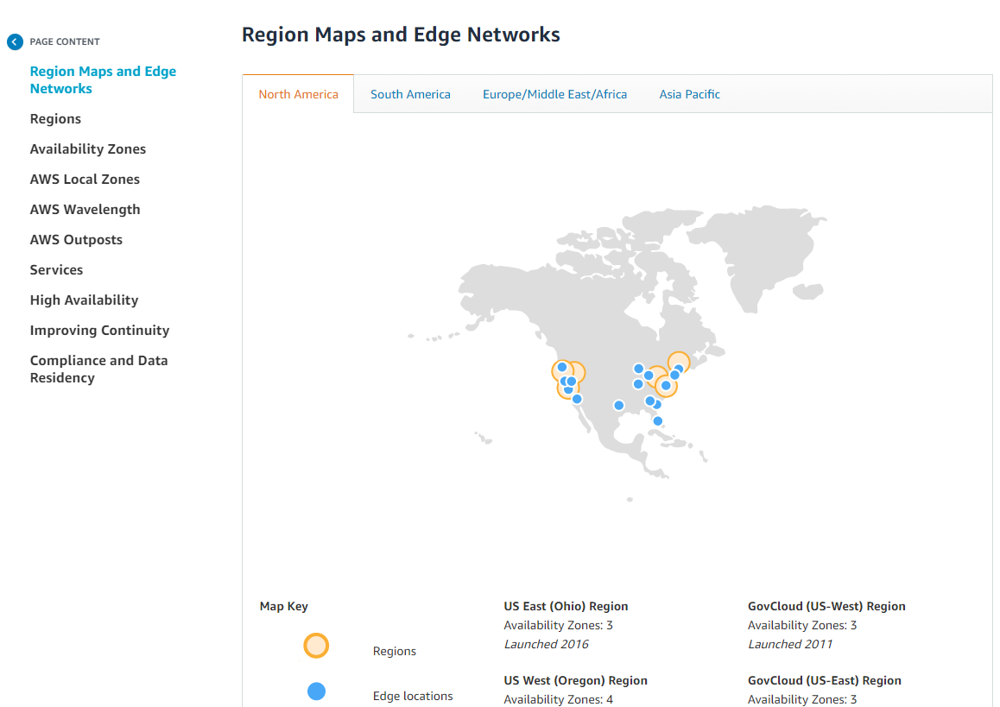

I am living in South Africa and a new region was launched in South Africa! 

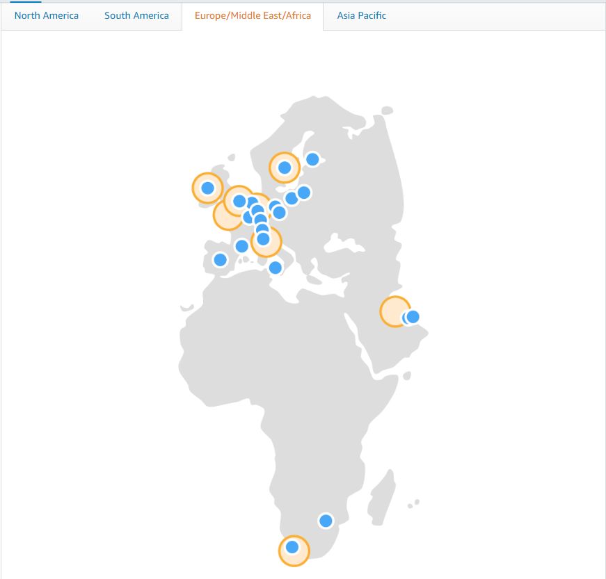

The AWS Africa (Cape Town) region above has three availability zones - three physically separate datacentres. 

## IAM Introduction

### AWS Management Console Basics

Before jumping straight into Identity and Access Management (IAM) it is worth looking at the AWS Management Console. Sometimes you forget to notice things because you are too focused on getting stuff done. The AWS Management Console is a portal to AWS cloud hosted services. It is accessible with through a browser such as Google Chrome by typing the address [https://aws.amazon.com/](aws.amazon.com). The console provides easy access to the hosted services. Each hosted service has its own dashboard where it can be managed. The console is not the only way to work with AWS cloud services - you can also use a CLI to access and manage AWS cloud hosted services. For the moment the focus is the AWS Management Console. The AWS Management Console is a central point for access to the consoles of the different AWS Services. Each AWS Service can be seen as an independent component. EC2 has its own console, for instance. S3 also has a console. Both services can be seen as independent components.

The navigation bar in the AWS Management Console is very important. It gives you access to several important aspects of AWS. On the left side you have two dropdown menus, Services and Resource Groups. You can pin services to the navigation bar - notice the pin. 

Of specific relevance to IAM is the second dropdown on the right side of the navbar. It contains the regions and AZs. 

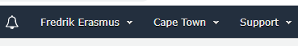

At the moment it is set to Cape Town. The dropdown contains other regions and AZs.

Notice how the divider works per continent - the US has four regions. Each of the US regions has its own availability zones. us-east-2 (Ohio) is the region. Looking at [AWS's Global Infrastructure](https://aws.amazon.com/about-aws/global-infrastructure/regions_az/?p=ngi&loc=2) the us-east-2 region has three availability zones - us-east-2a, us-east-2b and us-east-2c. Each az is denoted with a letter up to f. Each availability zone represents a physical data centre.

Two AWS Services are Global - S3 and IAM. Navigating to the IAM dashboard changes the region dropdown to global.

Same for the S3 dashboard. Navigating to the EC2 dashboard changes the region in my case to Cape Town. Cape Town is the region - it has three availability zones. What does it mean? It means I can have EC2 instances running in different regions and they will know nothing about each other. Creating an EC2 instance is region-specific. Other cloud hosted services work in the same way.

### AWS IAM Basics

The AWS IAM (Identity and Access Management) service is where your AWS security lives. Security refers to users, groups and roles. A root account should never be used or shared. The root account should only be used initially when you setup your AWS account. After the setup the root account should not be used. The root account poses a huge security risk. If your credentials are compromised the consequences can be really bad - someone can use your credentials to create services without your knowledge. The root account can pretty much do anything. You could be billed for things you did not activate. The AWS services make use of IAM - things like S3 and AWS RDS are all driven through IAM. 

Groups are collections of users designated by team or function. Groups also act as containers for policies. For instance, an administrator policy can be assigned to a group. Users can then be assigned to a group. Doing it this way is more efficient versus assigning policies on a per-user basis. AWS policies can be assigned to an individual user but also to a group. By creating a group and assigning a policy to a group you can easily assign users to the group.

Roles are internal to AWS resources. Important to note.

IAM has a global view - when you create a user, role or group it will be across all the regions. Permissions for users, groups or roles are granted through policies. IAM policies are written in JSON (JavaScript Object Notation). Managed policies are pre-configured policies so you don't have to write your own. The administrator policy is an example. Users need to be given the least amount of privilege - also referred to as the least privilege principle.

In AWS IAM terminology a users usually refer to a physical person. I say usually, because I had a scenario where I used an AWS IAM user to deploy an AWS Lambda from Azure Devops. In most cases a user refers to a physical person. Something I have gotten to understand a bit better is the notion of an email address not signifying uniqueness in AWS IAM terms. I can use an email address to register on the AWS Management Console as a root user. Basically creating my an account. I can also be an IAM user for a completely different organisation with the same email address. It is a concept I eventually understood. As a root user you can create IAM users. The IAM users are unique to the organization they belong too. A user with the same email address can belong to multiple organizations. Each user within each organization is completely different. 

When you set up your users the general rule is to have one IAM user per physical person. I'm not sure how the roles work yet - but having one role per application is a general rule. Each application has its own lifetime. You should never share IAM credentials. IAM credentials should not appear in code - will have to check this out. But I never put IAM credentials in configuration files - I use access keys. 

#### Find Services

A very quick way to get to IAM is to use the `Find Services` section from the AWS Management Console Dashboard.

You can start typing "IAM" in the textbox and click on the service in the dropdown. 

#### Recently visited services

The AWS Management Console shows recently used services in two places. The first is below the Find Service textbox. 

#### All Services

Below the Recently Visited Services a section for all the services is available.

#### Services Dropdown Menu

The navigation bar collapses and shows a panel with a history column on the left. On the right-side of the panel a similar listing of the services displayed in the All Services section.

#### One-click navigation shortcuts

Clicking on the pin in the navigation displays a panel with all the services. 

 

Dragging the service icon onto the navigation bar adds a shortcut.

 

#### AWS IAM Setup

At this point I already have an account on AWS - the root account. I'll be using the root account to perform the following steps:

- Customize the IAM sign-in page with an alias.
- Creating an IAM user
- Create a group and assign a managed policy to it. 
- Assign the IAM user to the policy
- Activating Multi-factor authentication with Google Authenticator for both accounts - IAM and root
- Log in with the IAM user on the custom URL

The IAM Management Console can be seen in the image below.

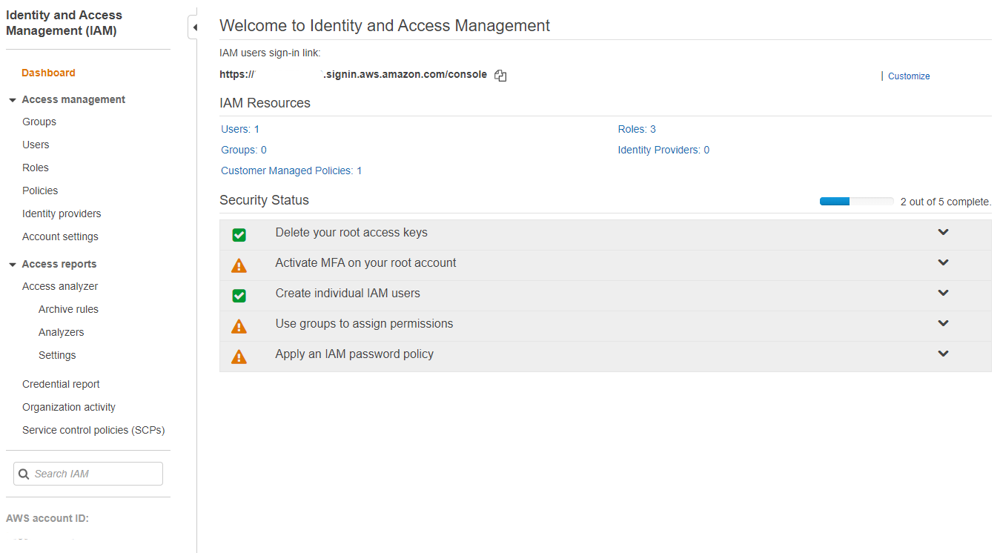 

Notice the IAM users sign-in link. It is customizable by clicking on `Customize`. Discovering the IAM sign-in link has highlighted something I previously never understood. The IAM sign-in link is not the same link you get when you login with a root account on aws.amazon.com. If you register an account on aws.amazon.com and login you are logged in as a root account not an IAM user. If someone other than you is the root user and they create you as an IAM user you cannot sign-in from aws.amazon.com in the same way as a root user. As an IAM user you have to specify an account alias. Its easy to understand once you have seen it in action. 

Clicking on `Customize` prompts you to provide an alias. 

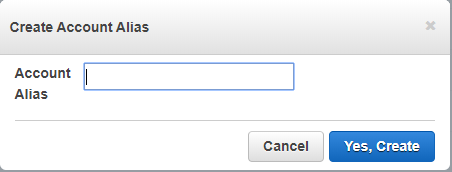 

With an alias the login page looks a bit different. At this point I do not have an IAM user to login with so I am having to login with the root user. 

Under IAM resources you can click on the Users. I am going to create a new IAM user. 

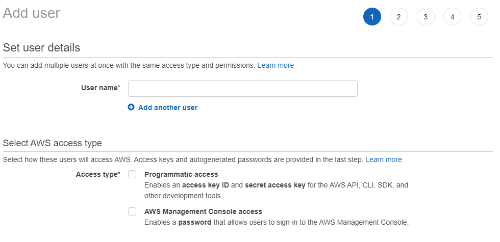 

I am going to sign-in with the user from now on instead of using the root account. I also want to use the user for working with the CLI. So I am going to select both programmatic access and AWS Management Console Access. Selecting both options prompts me an option to use an autogenerated password and a require password reset option. 

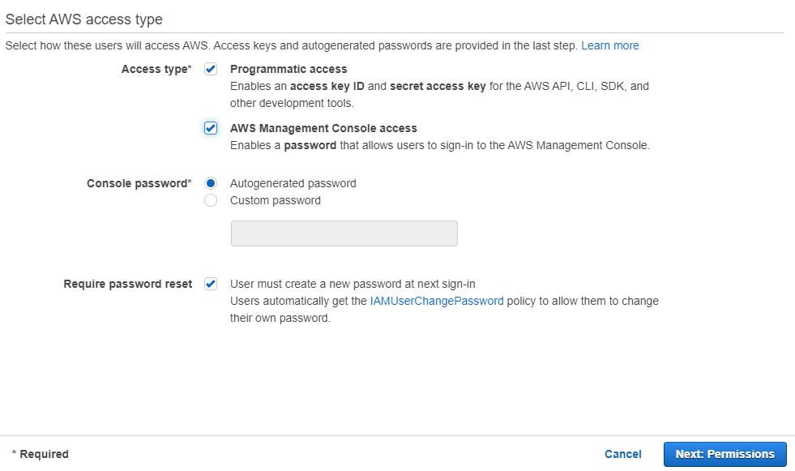 

Clicking the button to go to the Permissions I am presented with two options - I can either add the user to a group or attach policies directly. Permissions are the operations or actions I can perform on AWS services. Even though I do not see many people accessing this particular resource I feel it is better to create a group instead. 

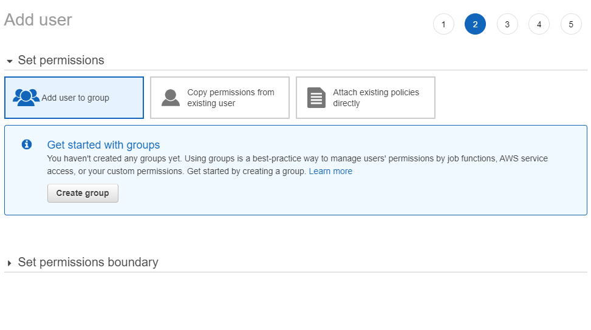 

So I basically create a new group called `administrators` and assign the managed policy `AdministratorAccess` to it.

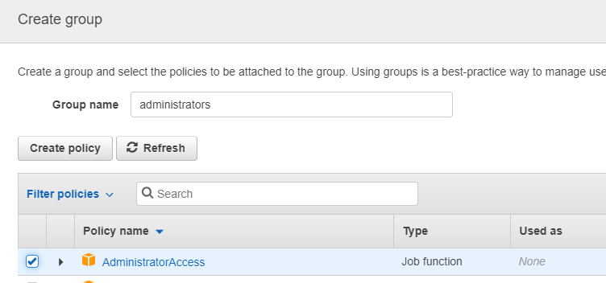 

With the newly created group the Add User screen looks is updated with the group selected.

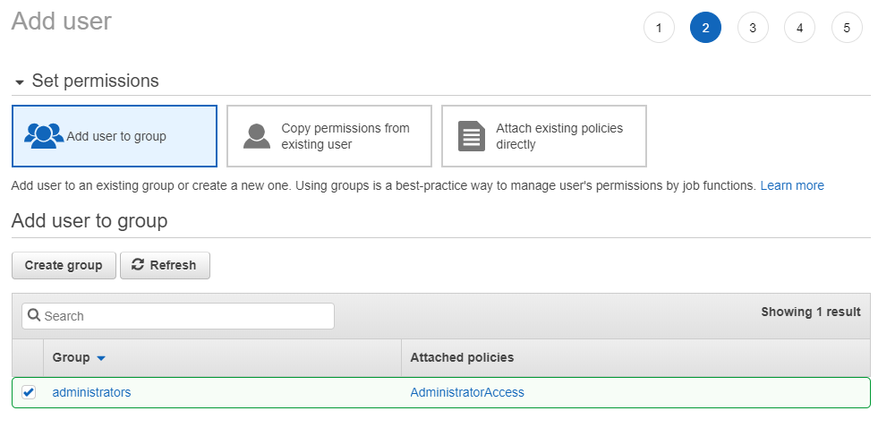 

I click `Next: Tags`, `Next: Review`. On the Review page I click `Create User`. I can then download the CSV with the credentials in them. Lets test the IAM user. It worked. Lets enable the MFA.

Updated IAM dashboard view.

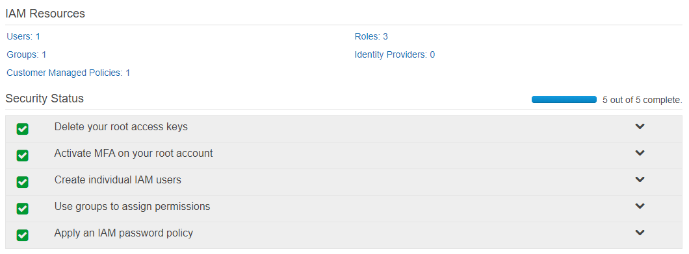 

