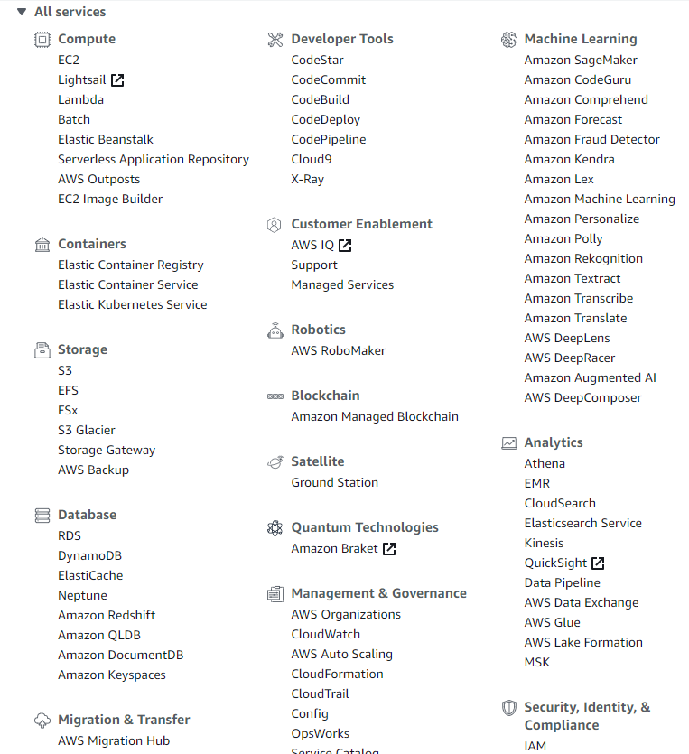

# AWS Certified Developer Associate

## AWS Fundamentals: IAM + EC2

### AWS Regions and AZs

Lets state the fundamental truth first - AWS provides cloud services. The cloud services are available in several regions around the world. The regions, such as North America, have what is called availability zones (AZs). An availability zone refers to a physical data centre within a region. Each availability zone is physically separate - isolation from disasters. Availability zones end up with a letter in the name, e.g. ap-southeast-2a. AWS Services can be available for a specific availability zone. An example would EC2 - its availability zone could be af-south-1. EC2 instances launched within the af-south-1 availability zone will physically run in a datacentre in South Africa. Each console for an AWS Service is region scoped, except S3 and IAM. The best approach is to work in the region closest to you. [The Global Infrastructure](https://aws.amazon.com/about-aws/global-infrastructure/) map shows all the AWS regions. Clicking on the `Regions and AZs` tab shows a map:

I am living in South Africa and a new region was launched in South Africa! 

Lets take a quick look at the AWS Management Console. Sometimes you forget to notice things because you are too focused on getting stuff done. The AWS Management Console is a browser-based view of AWS Services. The console is a starting point to access the consoles of the different AWS Services. Each AWS Service can be seen as its own separate thing. EC2 has its own console. So does S3. Both services can be seen as independent of each other. In my mind the AWS Management Console is a consolidated view of all the services available. Its not really a dashboard per se. 

The navigation bar in the AWS Management Console is very important. It gives you access to several important aspects of AWS. On the left side you have two dropdown menus, Services and Resource Groups. You can pin services to the navigation bar - notice the pin. 

Of specific relevance to IAM is the second dropdown on the right side of the navbar. It contains the regions and AZs. 

At the moment it is set to Cape Town. The dropdown contains other regions and AZs.

Notice how the divider works per continent - the US has four regions. Each of the US regions has its own availability zones. us-east-2 (Ohio) is the region. Looking at [AWS's Global Infrastructure](https://aws.amazon.com/about-aws/global-infrastructure/regions_az/?p=ngi&loc=2) the us-east-2 region has three availability zones - us-east-2a, us-east-2b and us-east-2c. Each az is denoted with a letter up to f. Each availability zone represents a data centre.

Two AWS Services are Global - S3 and IAM. Navigating to the IAM dashboard changes the region dropdown to global.

Same for the S3 dashboard. Navigating to the EC2 dashboard changes the region in my case to Cape Town. Cape Town is the region - it has three availability zones. 

## IAM Introduction

The AWS IAM (Identity and Access Management) service is where your AWS security lives. Security refers to users, groups and roles. A root account should never be used or shared. The root account should only be used initially when you setup your AWS account. After the setup the root account should not be used. The root account poses a huge security risk. If your credentials are somehow obtained by someone outside your organization the credentials can be used to do things. The root account can pretty much do anything - it can spin up services. So if someone where to gain access to your account using the root account bad things can happen. You could be billed for things you did not activate. The AWS services make use of IAM - things like S3 and AWS RDS are all driven through IAM. IAM policies are written in JSON (JavaScript Object Notation). 

Groups act as containers for policies. For instance, an administrator policy can be assigned to a group. Users can then be assigned to a group. Doing it this way is more efficient versus assigning policies on a per-user basis. AWS policies can be assigned to an individual user but also to a group. By creating a group and assigning a policy to a group you can easily assign users to the group.

Roles are internal to AWS Services.

In AWS IAM terminology a users usually refer to a physical person. I say usually, because I had a scenario where I used an AWS IAM user to deploy an AWS Lambda from Azure Devops. In most cases a user refers to a physical person. Something I have gotten to understand a bit better is the notion of an email address not signifying uniqueness in AWS IAM terms. I can use an email address to register on the AWS Management Console as a root user. Basically creating my an account. I can also be an IAM user for a completely different organisation with the same email address. It is a concept I eventually understood. As a root user you can create IAM users. The IAM users are unique to the organization they belong too. A user with the same email address can belong to multiple organizations. Each user within each organization is completely different. 

I registered as a root user a while back - have done it several times already. I'm not going to go through the AWS registration process again. I simply want to look at a few details relating to IAM. From the AWS Management Console you can navigate to the IAM Dashboard. You can get to the IAM service and many other AWS Services in several ways.

### Find Services

A very quick way to get to IAM is to use the `Find Services` section from the AWS Management Console Dashboard.

You can start typing "IAM" in the textbox and click on the service in the dropdown. 

### Recently visited services

The AWS Management Console shows recently used services in two places. The first is below the Find Service textbox. 

### All Services

Below the Recently Visited Services a section for all the services is available.

### Services Dropdown Menu

The navigation bar collapses and shows a panel with a history column on the left. On the right-side of the panel a similar listing of the services displayed in the All Services section.

### One-click navigation shortcuts

Clicking on the pin in the navigation displays a panel with all the services. 

 

Dragging the service icon onto the navigation bar adds a shortcut.

 

