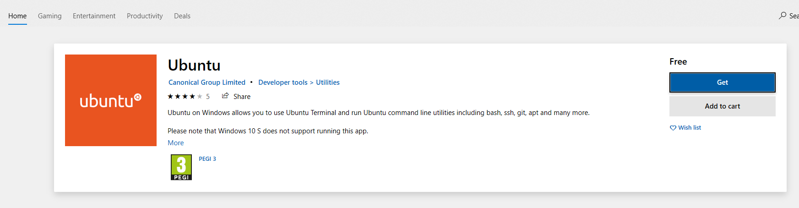
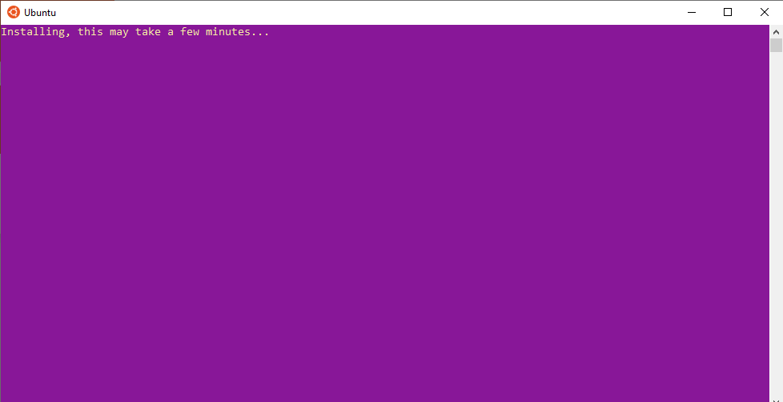
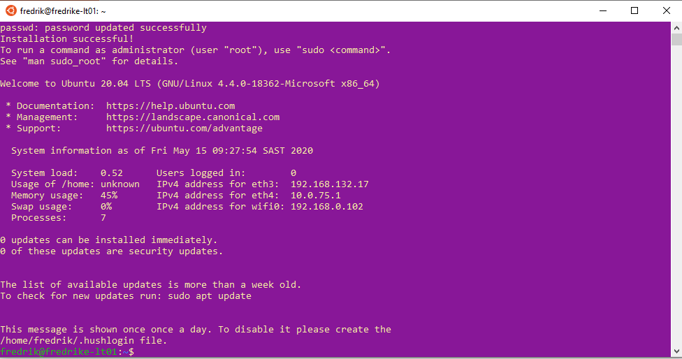

# Windows Subsystem for Linux (WSL)

Learning AWS EC2 means connecting to an EC2 instance using SSH. Connecting with SSH can be done with various operating systems. Windows 10 has a feature called Windows Subsystem for Linux (WSL). It provides a Linux operating system "inside" Windows. You have a fully functional Linux operating system. I'd be able to perform tasks like connecting to an EC2 instance through SSH. 

I am following along with the instructions on the [Microsoft Website](https://docs.microsoft.com/en-us/windows/wsl/install-win10). I ran the first command to enable WSL on the current machine:

`dism.exe /online /enable-feature /featurename:Microsoft-Windows-Subsystem-Linux /all /norestart`

I restarted the machine. Next I will select and install a Linux distro to use. I opened the Microsoft Store app to look for Ubuntu. 

You will need a Microsoft Account. I had to sign-in. After the download finished I clicked on Launch.

It ran successfully - I know it because it looks like this:

I previously installed Windows Terminal. It means being typing bash for any of the CLI tools starts a new bash session. Windows Terminal has tabs and allows for the selection of a CLI technology such as cmd or PowerShell. 

